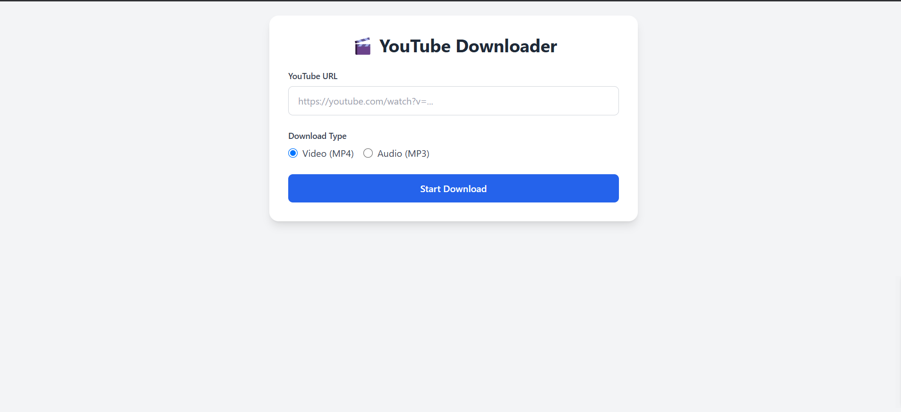

# YouTube Video Downloader 🎬

A modern web application for downloading YouTube videos and audio files, built with Python (Flask) and Tailwind CSS. This application provides a clean and intuitive interface for downloading YouTube content in MP4 (video) or MP3 (audio) format.

 <!-- Add a screenshot if available -->

## Features ✨

- **Video Download**: Download YouTube videos in MP4 format
- **Audio Extraction**: Extract audio from YouTube videos in MP3 format
- **Real-time Progress**: Track download progress with a beautiful progress bar
- **Download Stats**: View download speed and estimated time remaining
- **Automatic Cleanup**: Downloaded files are automatically cleaned up after 24 hours
- **Modern UI**: Built with Tailwind CSS for a sleek and responsive design
- **WebSocket Support**: Real-time updates using Flask-SocketIO

## Installation 🛠️

### Prerequisites

- Python 3.7+
- FFmpeg (for audio conversion)

### Setup

1. Clone the repository:
```bash
   https://github.com/swapnilshah10/YoutubeVideoDownloader.git
   cd YoutubeVideoDownloader
```

2. Create a virtual environment:

```bash
python -m venv venv
source venv/bin/activate  # On Windows: venv\Scripts\activate
```

3. Install dependencies:
```bash 
pip install -r requirements.txt
```

4. Run the application:
```bash
python main.py 
```

5. Access the application at 
```bash 
http://localhost:5000
```


Usage 🚀
1. Enter a YouTube URL in the input field

2. Choose between Video (MP4) or Audio (MP3)

3. Click "Start Download"

4. Watch the progress bar and stats update in real-time

5. Your download will start automatically when ready


Project Structure 📂
```bash
youtube-downloader/
├── app.py                # Main application file
├── requirements.txt      # Python dependencies
├── templates/
│   └── index.html        # Frontend HTML template
├── downloads/            # Temporary download storage
└── README.md             # This file 
```